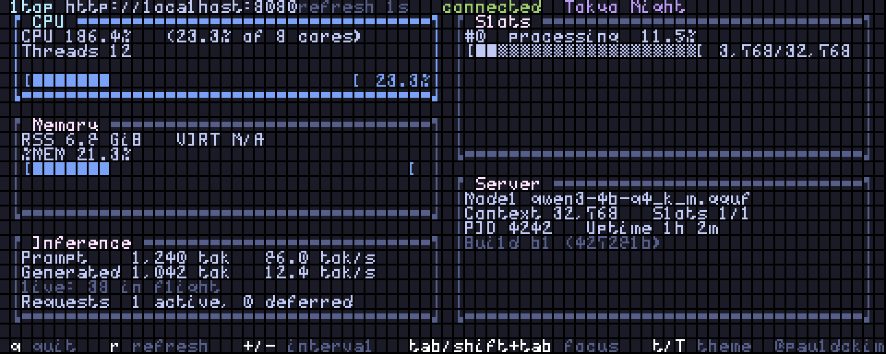
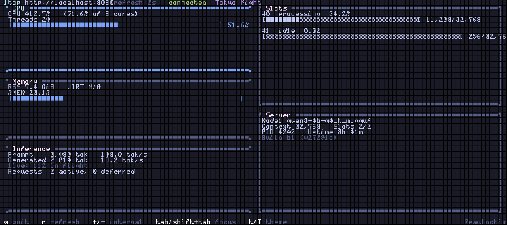

# ltop

**ltop** (LLM top) is a single-binary, keyboard-only terminal dashboard that
monitors a local [llama.cpp](https://github.com/ggml-org/llama.cpp)
`llama-server` and the OS process behind it — read-only. It polls the
server's `/metrics`, `/slots` and `/props` endpoints plus local process
CPU/memory and renders an integrated dashboard. No daemon, Prometheus, or
Grafana required.

- **Developer / distributor / rights holder:** [@pauldckim](https://github.com/pauldckim)
- **License:** proprietary freeware (see [LICENSE.md](LICENSE.md)). The
  **source code is not distributed** and is not available from the
  distributor.
- **Next release (staged 2026-09-08, publication pending):**
  **v0.1.2** — the first release shipping **all four platforms** (macOS
  arm64, macOS x86_64, Windows x86_64, Linux x86_64): API key
  authentication (`--api-key-file` / `LTOP_API_KEY`) and the Linux
  process-discovery fix (thread entries excluded). The staged archives
  are checksum-pinned in
  [`releases/v0.1.2/SHA256SUMS`](releases/v0.1.2/SHA256SUMS); the
  `v0.1.2` tag and GitHub Release are created at publication (see
  [CHANGELOG.md](CHANGELOG.md) for the full staged entry).
- **Current release:**
  [v0.1.1](https://github.com/pauldckim/ltop-release/releases/tag/v0.1.1)
  (published 2026-09-06) — adds macOS arm64 (Apple Silicon) and rebuilds
  macOS x86_64 at the new version; release assets are pinned in
  [`releases/v0.1.1/SHA256SUMS`](releases/v0.1.1/SHA256SUMS); see
  [docs/VERIFY.md](docs/VERIFY.md) for verification instructions.
- **Published releases:** [v0.1.0](https://github.com/pauldckim/ltop-release/releases/tag/v0.1.0)
  (published 2026-09-06) remains the current release for **Windows x86_64
  and Linux x86_64** (0.1.1 is macOS-only); its assets are pinned in
  [`releases/v0.1.0/SHA256SUMS`](releases/v0.1.0/SHA256SUMS).

## Screenshots

| 80×24 dashboard | Wide dashboard (120×40) |
|---|---|
|  |  |

*Genuine captures of ltop 0.1.0 running in macOS Terminal.app (Menlo 13,
exact 80×24 and 120×40 grids) against a loopback-only mock llama-server at
`http://127.0.0.1:8081` (mock `/metrics`, `/props` and dynamic `/slots`:
model `qwen3-4b-q4_k_m.gguf`, context 32,768, 2 slots, a live generation
in flight). CPU, memory, PID and uptime are real measurements of a
controlled local worker process on the capture host — its ephemeral PID is
shown as rendered; on macOS VIRT and thread count are N/A by design.
The 0.1.1 UI is identical to 0.1.0 (no product behavior changes), so
these captures remain representative. See
[docs/VERIFY.md](docs/VERIFY.md) for the capture procedure.*

## Features

- **Integrated dashboard** — CPU, Memory, Inference, Slots and Server panels
  in one screen, keyboard-only, single binary.
- **Live inference view** — while a slot is processing, the Inference panel
  shows in-flight tokens and a live tok/s derived from `/slots` (the
  server's generated-token counters only move when a slot is released, so a
  `/metrics`-only view would show a frozen total and `0.0 tok/s`
  mid-stream). Idle totals are labeled `done: completed tasks only`; the
  composed total never double-counts.
- **Per-source status** — each source carries `fresh` / `stale` /
  `unavailable` / `disabled` with the last-success time; a failing source
  never masquerades as fresh and never takes down the rest of the dashboard.
- **`/metrics` awareness** — llama-server only serves `/metrics` when
  started with `--metrics`. Without it, the Inference source is marked
  *disabled* while the other sources keep updating.
- **Local vs remote endpoints** — OS process metrics are collected only for
  local endpoints (`localhost` / `127.0.0.1` / `::1`); for remote endpoints
  the process source is shown as disabled (N/A).
- **Themes** — tokyo-night (default), catppuccin-mocha, dracula, nord.
- **Responsive layout** — the two-column dashboard at ≥ 80×24 degrades to a
  stacked compact layout in smaller terminals without clipping or panics;
  the footer key hints pack atomically and the `@pauldckim` attribution
  stays pinned to the right.

## Platform support

| Platform | Current artifact | Version | Signing status |
|---|---|---|---|
| macOS arm64 (Apple Silicon) | `ltop-v0.1.1-macos-arm64.zip` | 0.1.1 | **ad-hoc signed** — no Developer ID / notarization yet (see [docs/VERIFY.md](docs/VERIFY.md)) |
| macOS x86_64 (Intel) | `ltop-v0.1.1-macos-x86_64.zip` | 0.1.1 | **ad-hoc signed** — no Developer ID / notarization yet (see [docs/VERIFY.md](docs/VERIFY.md)) |
| Windows x86_64 | `ltop-v0.1.0-windows-x86_64.zip` | 0.1.0 | **unsigned** — no Authenticode yet (see [docs/VERIFY.md](docs/VERIFY.md)) |
| Linux x86_64 | `ltop-v0.1.0-linux-x86_64.tar.gz` | 0.1.0 | n/a (checksums only) — glibc dynamic build |

**0.1.1 is macOS-only**: it adds macOS arm64 (one generic
`aarch64-apple-darwin` target covering all M1–M5 Macs, deployment target
macOS 11.0/Big Sur) and rebuilds the macOS x86_64 artifact at the new
version. The published **0.1.0 Windows and Linux artifacts remain the
current release for those platforms** and are unchanged. Windows arm64
and Linux aarch64 are **not** included.

The macOS and Windows binaries are plain CLI executables; no native
installer (MSI/PKG/DMG/RPM) is shipped — a single binary plus a checksum is
the complete install (see [docs/DISTRIBUTION.md](docs/DISTRIBUTION.md)).

All shipped binaries are **stripped** (symbol/debug information removed)
and built with build-machine paths remapped to a neutral prefix, so no
machine-local paths are embedded in the shipped binaries (see
[docs/VERIFY.md](docs/VERIFY.md)).

## Installation

**One-line installer (macOS arm64/x86_64 and Linux x86_64):**

```sh
curl --proto '=https' --tlsv1.2 -fsSL https://raw.githubusercontent.com/pauldckim/ltop-release/install-v3/install.sh | sh
```

The installer is **tag-pinned** (`install-v3`, the current channel; the
previous `install-v2` and `install-v1` tags remain published and
immutable): the script and
the release artifacts it install are immutable. It detects your platform
(Rosetta-aware on macOS), downloads the pinned archive over HTTPS only
(no downgrade), verifies the archive, the release `SHA256SUMS` file and the
extracted binary against embedded SHA-256 values, and installs atomically
to `$HOME/.local/bin/ltop` — no sudo, no shell rc changes, no services.
Re-running it is a no-op when the expected binary is already installed; it
refuses to replace a different file without `--force` (or an interactive
yes), and `--uninstall` removes only files whose hash matches a known ltop
binary. Options: `--prefix DIR`, `--force`, `--uninstall`, `--dry-run`,
`--quiet`, `--help`.

> **Channel history:** `install-v3` (current) pins the **v0.1.2**
> artifacts for all three platforms (v0.1.2 is the current release for
> macOS arm64/x86_64 and Linux x86_64). The previous channels
> `install-v2` (macOS v0.1.1, Linux v0.1.0) and `install-v1` are
> **superseded but remain published and immutable** — users who already
> copied an older one-liner keep working. Per-channel script SHA-256
> values: [docs/VERIFY.md](docs/VERIFY.md) ("Installer").

> **Review before you pipe.** `curl | sh` executes whatever the URL serves
> at that moment. The tag pin makes the script immutable, but the review
> alternative is the stronger habit: fetch the script first, read it (it is
> short), then run it — or verify its SHA-256 against
> [docs/VERIFY.md](docs/VERIFY.md) before executing:
>
> ```sh
> curl --proto '=https' --tlsv1.2 -fsSL https://raw.githubusercontent.com/pauldckim/ltop-release/install-v3/install.sh -o /tmp/ltop-install.sh
> shasum -a 256 /tmp/ltop-install.sh   # compare with docs/VERIFY.md
> sh /tmp/ltop-install.sh
> ```
>
> The installer's own security properties (HTTPS-only, embedded hashes,
> redirect host restriction, atomic install, refusal semantics) are
> documented in [docs/INSTALL.md](docs/INSTALL.md) and
> [docs/DISTRIBUTION.md](docs/DISTRIBUTION.md) §5.1.

**macOS (both architectures) with Homebrew (one line):**

```sh
brew install --cask pauldckim/tap/ltop
```

The fully-qualified command auto-taps `pauldckim/tap` (repository
[`pauldckim/homebrew-tap`](https://github.com/pauldckim/homebrew-tap))
and, under Homebrew ≥ 6, trusts **only this cask** — no separate
`brew tap` or `brew trust` steps. The cask selects the archive for your
machine (macOS arm64 or x86_64, 0.1.1), downloads it from the official
release, and verifies its SHA-256. The 0.1.1 binaries are ad-hoc signed
but **not** Developer-ID signed or notarized, so the first run of a
quarantined download is blocked by Gatekeeper; `brew install` prints the
exact unblock procedure as cask caveats (verify checksum → remove the
quarantine recursively, or System Settings → Privacy & Security →
"Open Anyway"). See [docs/INSTALL.md](docs/INSTALL.md) and
[docs/DISTRIBUTION.md](docs/DISTRIBUTION.md) §5.

**Manual install (all platforms):** download the archive for your
platform — macOS from the v0.1.1 release, Windows/Linux from the
[v0.1.0 release](https://github.com/pauldckim/ltop-release/releases/tag/v0.1.0)
— verify the SHA-256 checksum ([docs/VERIFY.md](docs/VERIFY.md)), extract,
and put the binary on your `PATH`:

```sh
# macOS (Apple Silicon)
unzip ltop-v0.1.1-macos-arm64.zip
install -m 0755 ltop-v0.1.1-macos-arm64/ltop /usr/local/bin/ltop

# macOS (Intel)
unzip ltop-v0.1.1-macos-x86_64.zip
install -m 0755 ltop-v0.1.1-macos-x86_64/ltop /usr/local/bin/ltop

# Linux (0.1.0 — current Linux release)
tar xzf ltop-v0.1.0-linux-x86_64.tar.gz
install -m 0755 ltop-v0.1.0-linux-x86_64/ltop /usr/local/bin/ltop

# Windows (PowerShell, 0.1.0 — current Windows release)
Expand-Archive .\ltop-v0.1.0-windows-x86_64.zip
# then add the extracted folder to PATH, or run ltop.exe from it
```

Full per-OS instructions: [docs/INSTALL.md](docs/INSTALL.md).

> **Unsigned / ad-hoc-signed binaries.** The 0.1.1 macOS binaries are
> ad-hoc signed (the arm64 binary requires at least an ad-hoc signature
> to launch on Apple Silicon; the x86_64 binary is ad-hoc signed for
> consistency) but are **not** Developer-ID signed or notarized — on macOS,
> Gatekeeper will still block the first run of a quarantined download. The
> 0.1.0 Windows binary is unsigned; SmartScreen may show a warning.
> Verify the SHA-256 checksum first, then follow the platform notes in
> [docs/VERIFY.md](docs/VERIFY.md). These packages do **not** satisfy
> *official* Homebrew cask requirements (which need Developer ID +
> notarization); the own tap (`pauldckim/tap`) is the prepared Homebrew
> route and handles the blocked first run via explicit caveats — see
> [docs/DISTRIBUTION.md](docs/DISTRIBUTION.md) §5.

## Usage

```sh
# Default: monitor http://localhost:8080, poll every 1s
ltop

# Explicit endpoint (flag or positional)
ltop --endpoint http://localhost:8081
ltop http://myserver:8081

# Polling interval in seconds (0.5..=10.0)
ltop --endpoint http://localhost:8081 --interval 2

# Monitor a specific local process PID
ltop --pid 4242

# Theme preset (tokyo-night | catppuccin-mocha | dracula | nord)
ltop --theme dracula
```

| Option | Description |
|---|---|
| `-e, --endpoint <URL>` | llama-server endpoint (conflicts with the positional endpoint) |
| `[ENDPOINT]` | positional endpoint (cannot be combined with `--endpoint`) |
| `-i, --interval <SECS>` | polling interval in seconds, finite `0.5..=10.0` (default `1`) |
| `-p, --pid <PID>` | target process PID (local endpoints only) |
| `--theme <NAME>` | theme preset name |
| `-h, --help` / `-V, --version` | help / version |

The endpoint defaults to `http://localhost:8080`. A bare `host:port` is
normalized to `http://host:port`; `http`/`https` are the only accepted
schemes. ltop requires a TTY; piped/redirected stdout is rejected cleanly
before any control sequence is emitted.

### Keyboard

| Key | Action |
|---|---|
| `q` / `Ctrl-C` | quit |
| `r` | immediate refresh (coalesced) |
| `+` / `-` | increase / decrease polling interval (clamped to 0.5–10 s) |
| `Tab` / `Shift+Tab` | move panel focus (CPU → Memory → Inference → Slots → Server) |
| `t` / `T` | cycle theme forward / backward |

### Platform notes (N/A fields)

Process CPU% requires a time-differenced sample (the first sample is a
warm-up shown as N/A) and may exceed 100% on multi-core hosts; a
system-capacity-normalized 0–100% is shown alongside. Fields that are not
meaningful on a platform are shown as **N/A**, never as 0:

| Field | macOS | Windows | Linux |
|---|---|---|---|
| VIRT | N/A | reported | reported |
| Thread count | N/A | N/A | reported |

## License

ltop is distributed under a **proprietary freeware license**
([LICENSE.md](LICENSE.md)): free to use (personal, corporate internal,
research, production monitoring) and free to redistribute **unmodified**
with the license and notices intact; no sale, no modification, no reverse
engineering. It is **not** open source. Third-party components statically
linked into the binary are identified in
[THIRD_PARTY_NOTICES.md](THIRD_PARTY_NOTICES.md), which is
**self-contained**: it carries the verbatim license and copyright texts
collected from the cargo registry sources of all 299 locked packages
(gaps are flagged in the file, not papered over). The component inventory
is unchanged between 0.1.0, 0.1.1 and 0.1.2 (same dependency lock).
Canonical SPDX license texts under
[`third-party/licenses/`](third-party/licenses/) are a supplemental
reference, and the CycloneDX SBOMs are at
[`sbom/ltop-v0.1.2.cdx.json`](sbom/ltop-v0.1.2.cdx.json) (0.1.2),
[`sbom/ltop-v0.1.1.cdx.json`](sbom/ltop-v0.1.1.cdx.json) (0.1.1) and
[`sbom/ltop-v0.1.0.cdx.json`](sbom/ltop-v0.1.0.cdx.json) (0.1.0).

## Security

- Read-only monitoring: ltop sends no data anywhere and opens no
  listening ports; it only reads HTTP endpoints you point it at and local
  process statistics.
- Report vulnerabilities via **GitHub private vulnerability reporting**
  for this repository (Settings → Security → Private vulnerability
  reporting). There is no public security email. See
  [docs/SECURITY.md](docs/SECURITY.md).
- Checksums and current signature status: [docs/VERIFY.md](docs/VERIFY.md).

## Development

ltop is developed by **@pauldckim**. This repository is a **binary-only
release repository**: it contains release artifacts (as GitHub Release
assets), manifests, documentation and packaging templates — **no source
code**. Source contributions cannot be accepted here; use the issue tracker
for bug reports, feature requests and packaging problems.
See [CONTRIBUTING.md](CONTRIBUTING.md).

### Repository layout

```
LICENSE.md              proprietary freeware license (ltop itself)
THIRD_PARTY_NOTICES.md  self-contained third-party notices: component
                        inventory + verbatim license/copyright texts
third-party/licenses/   canonical SPDX license texts (supplemental)
sbom/                   CycloneDX SBOM (generated from the dependency lock)
releases/<ver>/SHA256SUMS  tracked checksum manifest per release
install.sh              one-line installer (tag-pinned at install-v3;
                        macOS + Linux, HTTPS-only, hash-verified, atomic)
docs/                   INSTALL, VERIFY, SECURITY, DISTRIBUTION
assets/screenshots/     dashboard screenshots (real Terminal captures
                        against a local mock server)
homebrew/               Homebrew cask reference copy (live cask is in
                        the pauldckim/homebrew-tap tap repository)
winget/                 WinGet manifest template (disabled until published/signed)
scripts/                public-safe release helpers (packaging, checksum
                        verification, pre-publish gate, cask generation)
                        + deterministic tests under scripts/tests/
                        (incl. test-install.sh for the installer)
```
